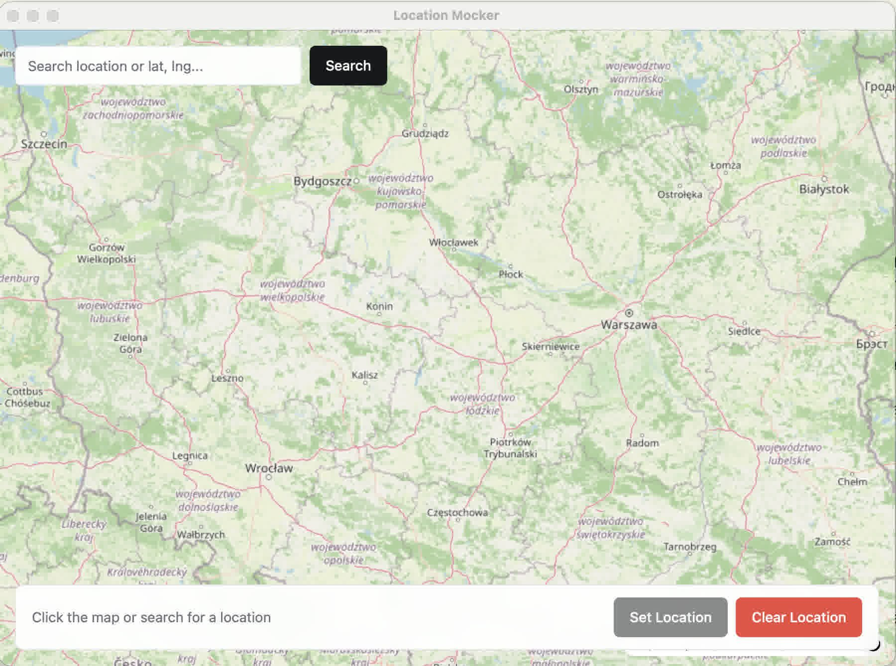

# loc-mock

> Mock GPS location on your iOS simulator. Pick a spot on a map — your simulator follows.



## Features

- **Map-based location picker** — click anywhere on the MapLibre GL OpenStreetMap to place a draggable marker
- **Search** — Nominatim autocomplete for place names, or type raw coordinates (`52.2297, 21.0122`)
- **Set Location** — runs `xcrun simctl location booted set` on a booted iOS simulator
- **Clear Location** — reverts to the simulator's real location
- **Auto-updater** — checks for updates on launch via GitHub Releases

## Prerequisites

- macOS **arm64** (Apple Silicon)
- [Bun](https://bun.sh)
- Xcode CLI tools (`xcode-select --install`)
- A **booted** iOS simulator

## Install

```bash
bun install
```

## Run

```bash
# Dev with HMR (concurrently Vite + Electrobun):
bun run dev:hmr

# Cold start (build web + Electrobun dev):
bun run dev
```

## Build

```bash
# Production build (Vite + Electrobun):
bun run build

# Package as drag-to-Applications DMG:
bun run release:local

# DMG is written to release/
```

## Release

Push a `v*` tag. [CI](.github/workflows/release.yml) builds, packages a DMG, and attaches it to the GitHub release.

## Architecture

Two-process Electrobun app:

- **`src/bun/index.ts`** — main process: app menu, window creation, RPC handlers. Shells to `xcrun simctl location`.
- **`src/mainview/`** — webview UI: React 18 + shadcn/ui, MapLibre GL map with Nominatim geocoding. Communicates via typed Electrobun RPC.

The RPC contract lives in [`src/shared/types.ts`](src/shared/types.ts) — changes must stay in sync between both processes.

## Tech stack

| Layer | |
|-------|---|
| Desktop framework | [Electrobun](https://electrobun.dev) (Bun-based, macOS) |
| Runtime | [Bun](https://bun.sh) |
| Frontend | React 18, TypeScript, Tailwind CSS v3, shadcn/ui |
| Map | [MapLibre GL](https://maplibre.org) via react-map-gl/maplibre |
| Geocoding | [Nominatim](https://nominatim.openstreetmap.org) (OSM) |
| Toasts | [Sonner](https://sonner.emilkowal.ski) |
| Build | Vite 6 + Electrobun CLI |
